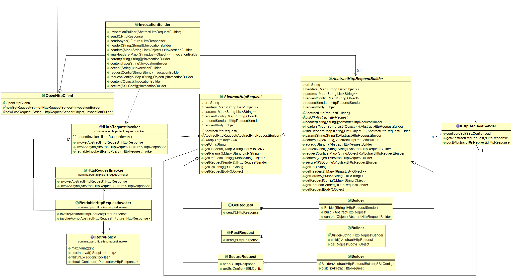

# open-http-client
A reference implementation for a HTTP client wrapper which allows decoupling the consumer application from the underlying native HTTP client library and uses a standard language for sending HTTP requests and receiving HTTP response

## Problem discovery
Working interchangeably with different HTTP clients is challenging.
Ideally, any change in the native HTTP client being used, should be decoupled from the application consuming it.
Most of the native HTTP clients does not follow a standard language for their consumers to interact with, hence keeping open a risk of any change on the native implementation leaking into the consumer application.

In my previous employment we were responsible for building REST APIs around a solid secure vault that was to store all the PKI material.
Now from the API layer the vault was to be reached out using Jersey Client, but the rest of the third party services were to be reached out using Apache HTTP Client. So from the API layer the Jersey Client and Apache HTTP client were both to be used for reaching out to different third party services.
We ended up building a separate sub-system, involving request building and response handling, for each type of native HTTP client.

In an earlier employment, we faced a requirement to shift the HTTP client from HTTPUrlConnection to Jersey-Client. Team identified this change to be risky, and big, because both the schemes adopt a different language to set up SSL configuration and accept request and parsing response.

Both the above experience (problems) led to this solution - "Using various HTTP Client native libraries in such a way that the consumer application is decoupled from concrete implementations of HTTP clients and hence is not impacted with any change in the native HTTP client area"

## Quick glimpse
Lets take a quick overview of how the Open Http Client looks from the consumer application perspective:

```java
OpenHttpClient.newGetRequest(baseUri + path, httpRequestSender)
	.accept("application/json")
	.headers(headers)
	.secure(newSSLConfig().getSSLConfig())
	.retry(retryPolicy)
	.disableRetryAfter()
	.send(delayedHttpResponseHandler)
	.getBody();
```
`OpenHttpClient` is a simple <i>Facade</i> which simplifies the use of this module. `OpenHttpClient.newGetRequest` creates a new `InvocationBuilder` for a GET request. Similar APIs exists for POST, PUT, DELETE requests.<br>
`InvocationBuilder` is a <i>Builder</i> which offers several APIs which can be chained together for building a request, sending it over HTTP and handling the response.
The `httpRequestSender` must be an implementation of `IHttpRequestSender`. This represents the native HTTP client.
<ul>
	<li>`InvocationBuilder.accept(...)` sets the accepted mime types for this request,</li>
	<li>`InvocationBuilder.headers(...)` sets the request headers for this request,</li>
	<li>`InvocationBuilder.secure(...)` takes an `SSLConfig` which holds all the information that would help the native HTTP client to build the SSLContext
	<li>`InvocationBuilder.retry(...)` accepts a `IRetryPolicy` implementation and enables retrying the HTTP requests in case of failures</li>
	<li>`InvocationBuilder.disableRetryAfter()` disables handling the Retry-After header sent back in the HTTP response from the server</li> 
	<li>
		`InvocationBuilder.send(...)` sends an `AbstractHttpRequest` as a <i>Command</i> to an `IHttpRequestInvoker` implementation
		<ul>
			<li><strong>IHttpRequestInvoker</strong> then executes the <strong>AbstractHttpRequest</strong> <i>Command</i> and,</li>
			<li><strong>AbstractHttpRequest</strong> <i>Command</i> then invokes the <strong>IHttpRequestSender</strong></li>
		</ul>
		`InvocationBuilder.send()` takes an `IDelayedHttpResponseHandler` implementation, to handle any responses coming from scheduled requests. Requests are scheduled when Retry-After response header is processed. This handler is invoked with the final `HttpResponse` when all the scheduled requests are executed
	</li>
	<li>`HttpResponse.getBody()` extracts the response content</li>
</ul>
See the javadocs for more APIs, and Wiki for how those work. 

## Class Diagram


## Design Patterns Used:
<ul>
	<li>Facade</li>
	<li>Command</li>
	<li>Decorator</li>
	<li>Builder</li>
	<li>Strategy</li>
</ul>

## Long story cut short
<p>
	Any local application service would call OpenHttpClient Facade to build and send a AbstractHttpRequest Command to the IHttpRequestInvoker Command-Invoker.
	Building an AbstractHttpRequest Command also involves choosing a concrete IHttpRequestSender Command-Receiver (also known as Request-Sender given the context)
	The IHttpRequestInvoker Command-Invoker invokes the AbstractHttpRequest Command with zero or more IHttpRequestInvoker Decorators
	The AbstractHttpRequest Command when invoked, executes the IHttpRequestSender Command-Receiver methods to send HTTP requests and receive HTTP responses
</p>